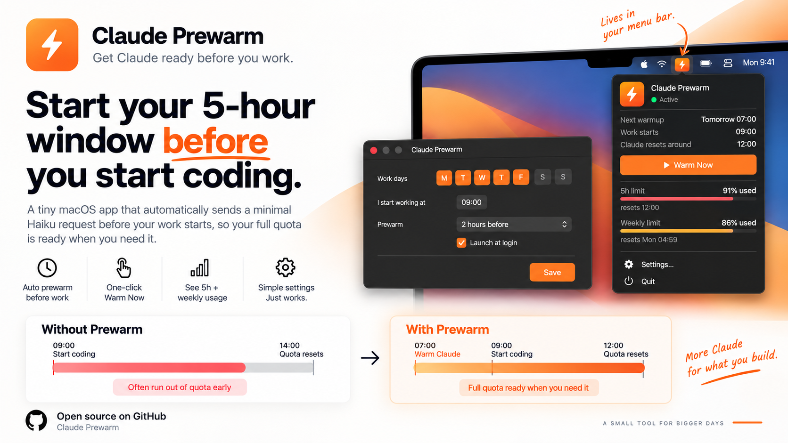
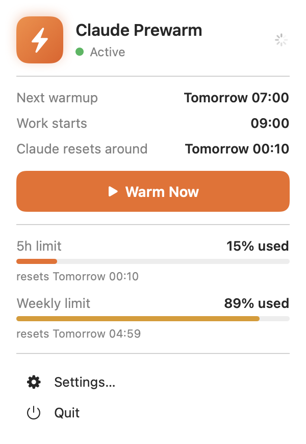
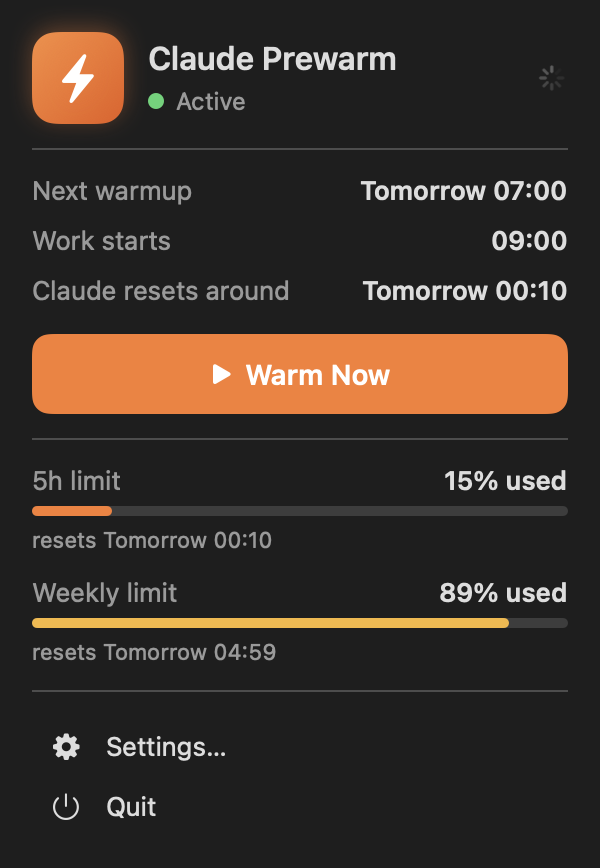
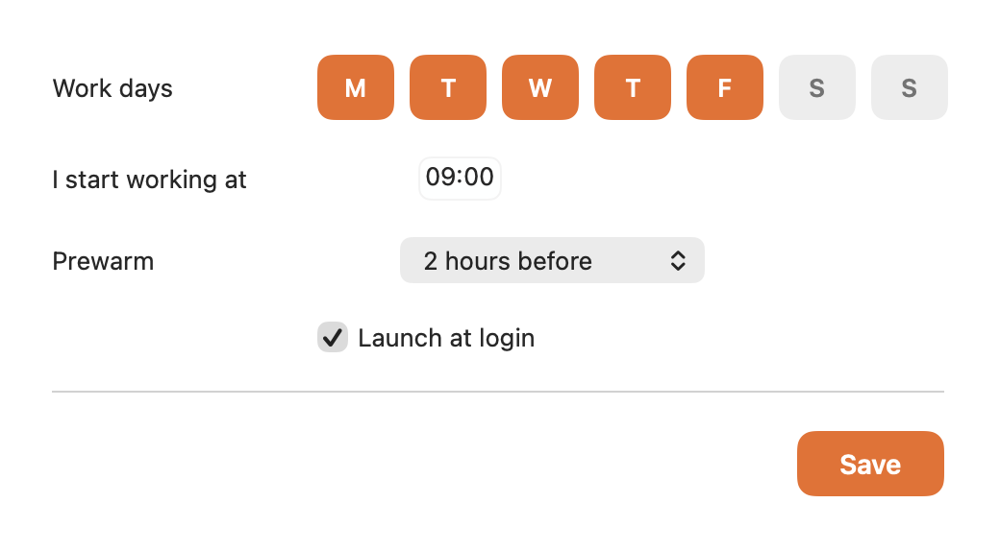
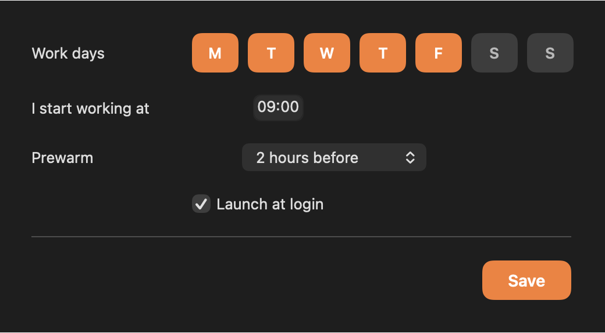
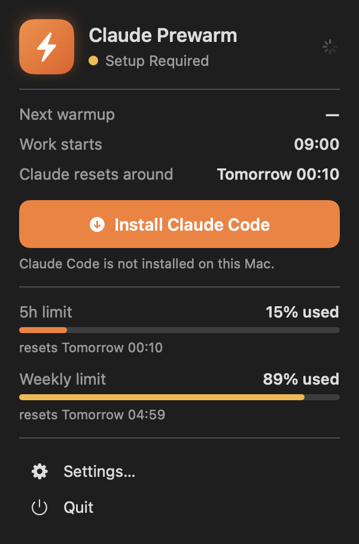

<p align="center">
  
</p>

<h1 align="center">Claude Prewarm</h1>

<p align="center">
  A macOS menu bar app that starts your Claude usage window before you sit down.<br>
  <a href="https://github.com/Charonyuu/Claude-prewarm/releases/latest"><b>Download for macOS</b></a>
  · 100% local · No API keys · No telemetry
</p>

---

## The problem

Claude Code gives you a rolling **5-hour usage window**. The clock starts on your
first request of the day — so if you start work at 09:00, your window runs to 14:00,
and you spend the whole afternoon waiting for it to reset.

## What this does

Claude Prewarm sends **one tiny request** at a time you choose, before work.

```
Without Prewarm                    With Prewarm
09:00  first request               07:00  app warms for you
14:00  window resets               09:00  you start work
       ↑ mid-afternoon             12:00  window resets
                                          ↑ before lunch
```

Same quota, earlier window. You reach your next reset sooner in the working day.

> It does **not** give you more usage. It only moves the window.

## Install

**With Homebrew:**

```bash
brew install --cask Charonyuu/tap/claude-prewarm
```

`brew upgrade` keeps it current from then on.

**Or one command, without Homebrew:**

```bash
curl -fsSL https://raw.githubusercontent.com/Charonyuu/Claude-prewarm/main/install.sh | bash
```

Downloads the latest release, checks Apple's notarization, installs it to
`/Applications` and launches it.

**Or by hand:**

1. **[Download the latest dmg](https://github.com/Charonyuu/Claude-prewarm/releases/latest)**
2. Open it, drag **Claude Prewarm** into Applications
3. Launch it — a bolt appears in your menu bar

**Or ask Claude Code to do it**, since you already have it:

> Install Claude Prewarm from github.com/Charonyuu/Claude-prewarm

Signed and notarized by Apple, so it opens with no security warnings.

**You need:**

- macOS 14 (Sonoma) or later
- [Claude Code](https://docs.claude.com/en/docs/claude-code/setup) installed and signed in

The app uses the Claude CLI you are already signed in to. There is no API key to
enter and nothing to configure beyond your working hours.

## Using it

Click the bolt in your menu bar.

| Light | Dark |
|---|---|
|  |  |

**Next warmup** — when the app will warm next
**Work starts** — the time you told it you start
**Claude resets around** — when your current 5-hour window ends
**Warm Now** — warm immediately, if you want to start the clock by hand
**5h limit / Weekly limit** — how much of each window you have spent, read live
from Claude itself, refreshed every time you open the panel

### Settings

| Light | Dark |
|---|---|
|  |  |

- **Work days** — pick any combination, at least one
- **I start working at** — your usual start time
- **Prewarm** — how far ahead to warm: 30 minutes, 1, 2, 3 or 4 hours
- **Launch at login** — so it is always ready

With the defaults — Mon–Fri, 09:00, 2 hours before — the app warms at 07:00 on
weekdays and your window resets around 12:00.

### If Claude Code is missing



The app tells you and links to the install instructions. Once the CLI is installed
and signed in, open the panel again and it picks it up.

## Good to know

**What is actually sent?** One request to Haiku, the smallest model, saying
`Reply only OK.` It costs a fraction of a cent of your quota and takes a few seconds.

**Will it warm twice?** No. It refuses to warm again within 10 minutes, and it never
retroactively warms a time that already passed — so opening the app in the afternoon
does not fire a warm you did not ask for.

**What if my Mac was asleep?** If the warm was missed and it is less than an hour
late on a work day, it runs when your Mac wakes. Later than that, it waits for
tomorrow.

**Does it interrupt me?** Only when something fails. A successful warm is silent.

**Is any of this sent anywhere?** No. Settings live in `UserDefaults` on your Mac.
The app talks to nothing except the Claude CLI already installed on your machine.

## Build from source

```bash
git clone https://github.com/Charonyuu/Claude-prewarm.git
cd Claude-prewarm
./build.sh --install
```

Needs Xcode. The app is a Swift package — `Sources/ClaudePrewarm` holds everything.

```
App/          App entry, AppState, settings window
Models/       AppSettings, RuntimeState, WarmLog, UsageSnapshot
Services/     ClaudeRunner, UsageReader, ProcessRunner, ScheduleService,
              LoginItemService, SettingsStore, NotificationService
Views/        MenuBarView, SettingsView, Theme
Utilities/    DateCalculator, ClaudeBinaryFinder
```

Under the hood it runs:

```bash
claude -p "Reply only OK." --model haiku --effort low \
    --no-session-persistence --strict-mcp-config --disable-slash-commands
```

…in an empty directory, so no project files or `CLAUDE.md` are read, with a 30
second timeout. The limits block comes from `claude -p "/usage"`.

Run the checks — schedule maths, usage parsing, then one real warm and one real
usage read:

```bash
./Tools/verify.sh
```

## Releasing

```bash
./build.sh --release
```

Then upload the dmg to a GitHub release and bump `version` and `sha256` in
[the cask](https://github.com/Charonyuu/homebrew-tap/blob/main/Casks/claude-prewarm.rb).

Signs with Developer ID under the hardened runtime, builds a dmg, notarizes it and
staples the ticket. Notarization credentials are stored once:

```bash
xcrun notarytool store-credentials "prewarm-notary" \
    --apple-id "<your Apple ID>" \
    --team-id "<your team id>" \
    --password "<app-specific password>"
```

Without them the script still produces a signed dmg and says what is missing.

## Licence

MIT. See [LICENSE](LICENSE).

Not affiliated with Anthropic. "Claude" is a trademark of Anthropic, PBC.
